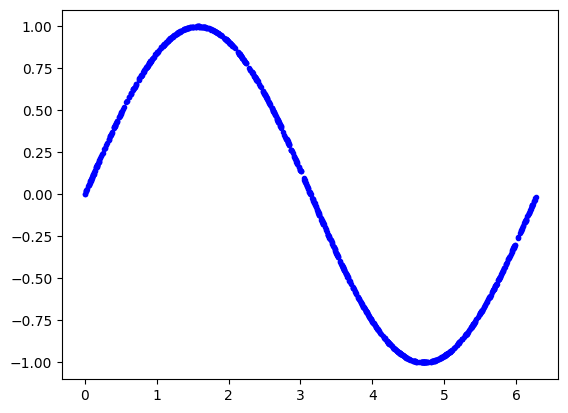
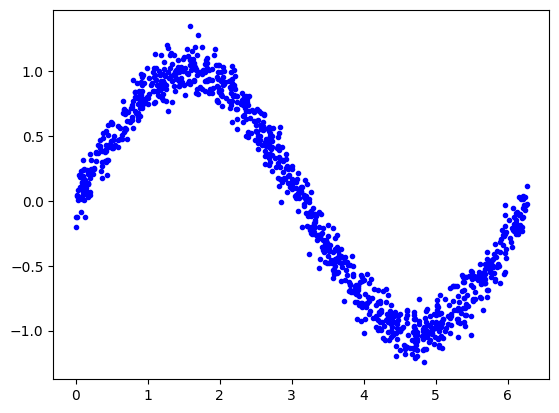
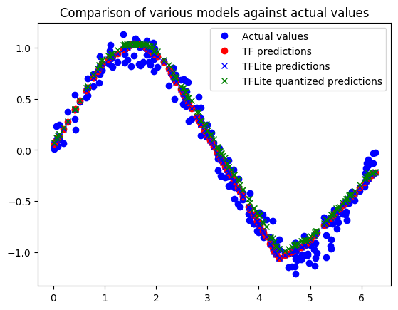
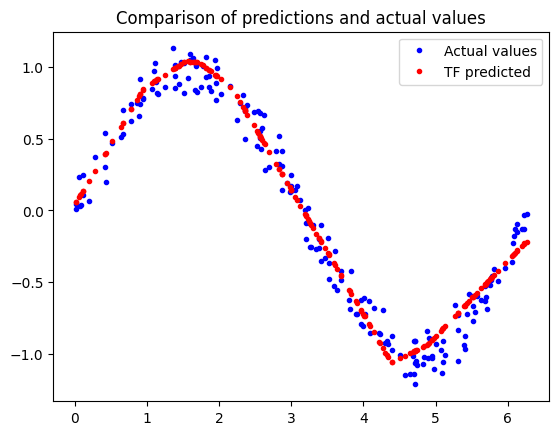
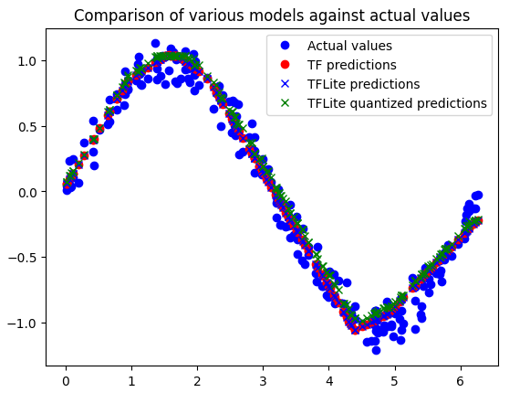
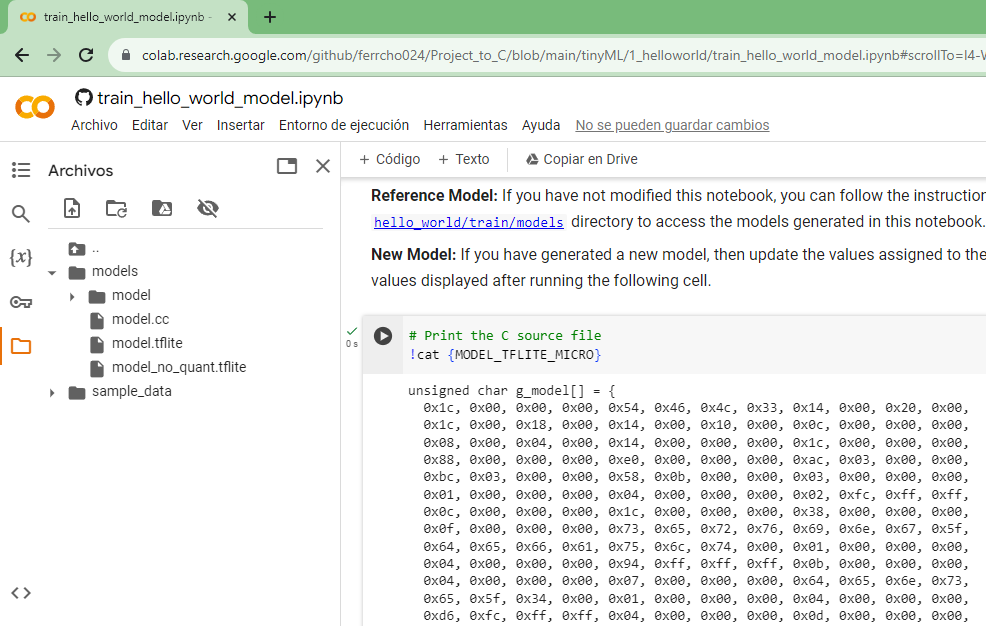
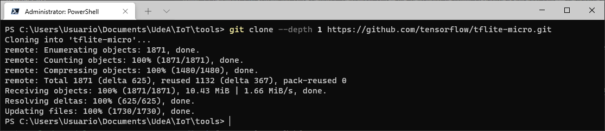
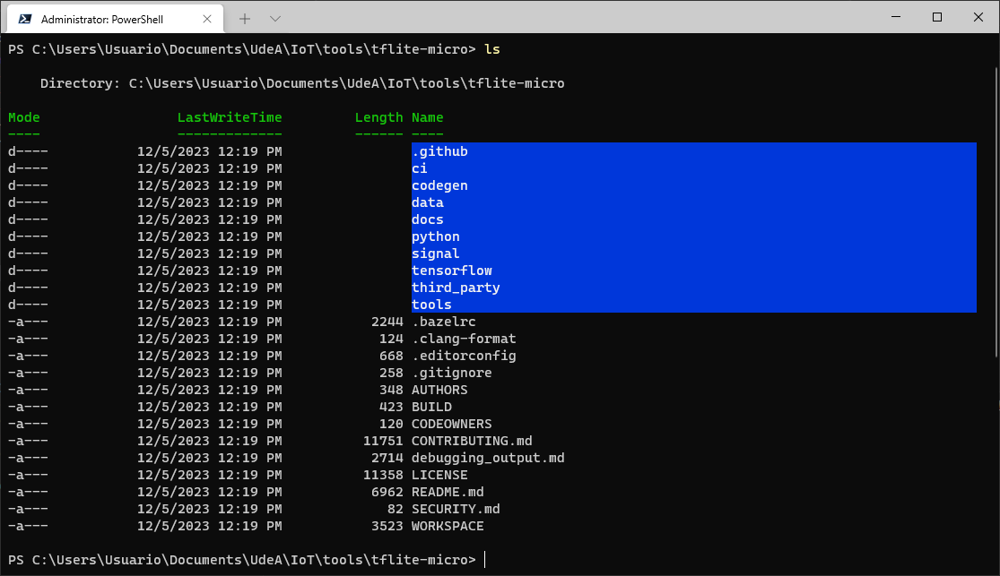
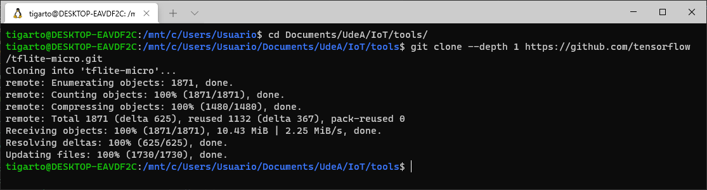
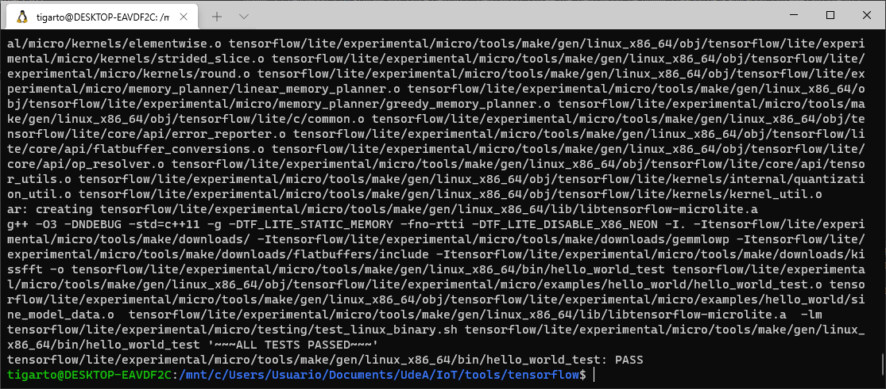

# Ejemplo 1 - Hello World

## Parte 1 - Entrenamiento del modelo

Este es el primer ejemplo en el cual, lo que se hace es entrenar el modelo para que aprenda la funcion seno. 
1. Ejecute el notebook en entrena la red: [train_hello_world_model.ipynb](train_hello_world_model.ipynb)
2. Observe los resultados, que estos sean desentes. En el caso tenemos lo siguiente:
   
   * **Funcion a aprender**:
     
     
  
   * **Funcion a aprender mas ruido**:
     
     

   * **Division de los datos: entrenamiento - test - validacion**:

     

   * **Resultados del modelo aprendido (que dio) con tensorflow y comparación con la funcion original**:

     

   * **Resultados del modelo aprendido (que dio) con tensorflow-lite y comparación con el tensor flow normal y la funcion original**

     

2. Descargar los archivos generados:
   
   

   En este caso los archivos resultantes fueron:
   * [model.cc](model.cc)
   * [model.tflile](model.tflite)
   * [model_no_quant.tflile](model_no_quant.tflite)

En teoria ya esta listo el modelo para trabajarlo, el corazon de esta parte el la matriz asociada al modelo. A continuación, lo que sigue es como realiza la implementación en el micro de esto. 

> **Importante**: En el ejemplo [hello_world](https://github.com/tensorflow/tflite-micro/tree/main/tensorflow/lite/micro/examples/hello_world) nuevo, se explica el procedimiento anterior cuando el resultado se hace en una maquina local. Para ello hay que instalar [bazel](https://bazel.build/?hl=es-419), se intento hace el entrenamiento, test y validación hechos anteriormente, pero salian errores.

## The "Hello World" de TinyML: Creación de la aplicación

> **Importante**: El repositorio del ejemplo del libro cambio, respecto al que se encuentra actualmente de modo que es importante tener en cuenta este detalle. A continuación se muestran los enlaces de interes:
> * **Repo ejemplos libro**: [link](https://github.com/tensorflow/tensorflow/tree/be4f6874533d78f662d9777b66abe3cdde98f901/tensorflow/lite/experimental/micro/examples/hello_world)
> * **Repo (oficial) ejemplos actual**: [link](https://github.com/tensorflow/tflite-micro/tree/main/tensorflow/lite/micro/examples)

### Ejecución de test en la maquina de desarrolo

#### Windows sin WSL (no nada, jodidos)

Para compilar y testear este ejemplo en una maquina (ojala con sistema Linux o macOS) se siguen los pasos que se describen en la documentación oficial. Sin embargo, para nuestro caso, vamos a intentar hacerlo con lo que tenemos:
* Maquina con Windows (de 10 para arriba)
* WSL (lo ideal es que lo instale para evitar dolores de cabeza y hacer todo el proceso como si estuviera en linux)

Por ahora, como somosm mazoquistas, vamos a intentar trabajar sin WSL tratando de usar las herramientas instaladas al principio ([link](../README.md)). Segun el libro se necesita:
* git: Cualquier version
* make: Minimo la 3.82

1. Descargar el repo oficial:
   
   ```
   git clone --depth 1 https://github.com/tensorflow/tflite-micro.git
   ```

   

2. Ingrese al directorio de tflite-micro:

   ```
   cd tflite-micro
   ```   

   

3. Realizar los test del HelloWorld

   ```
   make -f tensorflow/lite/micro/tools/make/Makefile test_hello_world_test
   ```   

   > **Importante**: Si esta en Windows no lo corra en alguna terminal de windows por que no da. Corralo el bash del git.

**Conclusión**: No dio, mejor hagamoslo desde el principio en el WSL

#### Windows con WSL

1. Descargar el repo oficial:
   
   ```
   git clone --depth 1 https://github.com/tensorflow/tflite-micro.git
   ```

   

2. Realizar los test del HelloWorld

   ```
   make -f tensorflow/lite/micro/tools/make/Makefile test_hello_world_test
   ```  

   Por lo menos parece que los test pasaron, pero eso es por que se tenia el modelo que venia ya entrenado. La pregunta es ¿como probar tenemos entrenado?


Hasta aqui vamos en orden...

* BUILD viejo: https://github.com/tensorflow/tensorflow/blob/be4f6874533d78f662d9777b66abe3cdde98f901/tensorflow/lite/experimental/micro/examples/hello_world/BUILD
* BUILD actual: https://github.com/tensorflow/tflite-micro/blob/main/tensorflow/lite/micro/examples/hello_world/BUILD

### Otro intento *

Usemos el del libro a ver que pasa: https://github.com/tensorflow/tensorflow/tree/be4f6874533d78f662d9777b66abe3cdde98f901


```
git clone --depth 1 https://github.com/tensorflow/tensorflow.git
cd tensorflow/
make -f /tensorflow/lite/experimental/micro/tools/make/Makefile test_hello_world_test
```

### Otro intento **

Descargar mejor el zip, pues cuando se hace el git clone muchos de los archivos que aparecen en el repo viejo no se copian localmente, en cambio cuando se hace la descarga del comprimido todo si va:
   
```
cd tensorflow/
make -f tensorflow/lite/experimental/micro/tools/make/Makefile test_hello_world_test
```

Salio lo siguiente:



  
```
make -f tensorflow/lite/experimental/micro/tools/make/Makefile hello_world   
```
